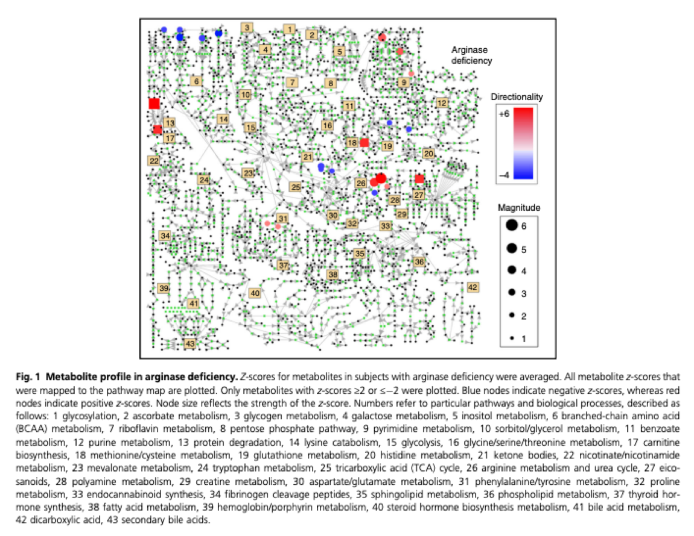
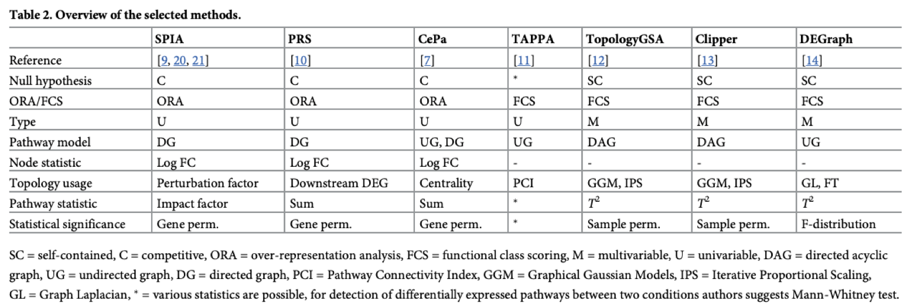

# Metabolomics-Data-Portal
Metabolomics Data Portal R shiny application for the visualization and analysis of untargeted metabolomics datasets.

# Introduction:
Metabolomics is a fast maturing field which has an intimate relationship to the phenotypes observed in the clinic and is easily actionable for prospective treatment regimens. 


Within the field of metabolomics is the distinction between clinical research metabolomics, which follows a case-control cohort design; and clinical testing metabolomics which compares a single patient to a reference population.

{:height="50%" width="50%"}

Differences in data collection percolate to differences in analysis needs. Currently, for N-of-1 clinical testing metabolomics, state of the art analysis methods rely on pathway enrichment methods.

{:height="50%" width="50%"}

To quantify perturbations observed in pathway knowledgebases, popular set-based methods such as over-representation analysis (ORA) and metabolite-set enrichment analysis (MSEA) are employed. However, these methods have been criticized for their use of gene sampling in lieu of patient sampling to generate p-values, and for their use of competitive null hypotheses in lieu of self-contained null hypotheses, which have shown to be less powerful (due to their less restrictive nature) in comparison (Goeman & Bulhmann, 2007). 

While various tools currently exist for metabolomics data analysis and pathway analysis (e.g., Metabolomics Workbench, PhenoMeNal and Metaboanalyst, Metscape, Mummichog, MetaMapp, and MetDisease), there are many shortcomings to these existing web tools. Some of these platforms employ popular machine learning models to analyze metabolomics data: unsupervised dimensionality reduction methods to view outliers or batch effects, and clustering methods to look for differences between cases and controls. Existing tools are not tailored for single patient analysis (i.e., N-of-1), such as in clinical testing metabolomics, and are more helpful for case-control cohort design data collection methods.

# Enter, topological enrichment methods!
Topological enrichment methods (good review papers found in Braun & Shah, 2005 and Ihnatova, Popovici & Budinska, 2018) have shown to be more sensitive than set-based enrichment analysis methods.

{:height="50%" width="50%"}

# Problem
Modern day topological enrichment methods are all narrowly implemented for the analysis/interpretation of differentially expressed *gene sets*, and do not extend their functionality to the analysis and interpretation of perturbed metabolite sets.

# Our Solution
We have examined several R package implementation of existing topological enrichment methods and modified them to be useful for the analysis of metabolite sets, and for an N-of-1 metabolomics data.


Features:
1. Datasets included from published papers including clinical subjects with metabolic diseases.
2. Pathway visualization software and statistical interpretation metrics.
3. New topology-based pathway enrichment analysis methods.
4. Private data upload portal to use above tools on private datasets.

## Installation
- Dependencies:
- with [remotes](https://cran.r-project.org/web/packages/remotes/index.html)
```{r}
remotes::install_github("NCBI-Hackathons/Metabolomics-Data-Portal")
```

## Usage

## Data formats
- Input data
  - tabular data with rows as metabolites and columns as samples; data should be transformed Z-scores
- [Example data](https://github.com/NCBI-Hackathons/Metabolomics-Data-Portal/tree/master/data)


## Example Shiny Site
- Configure the docker-compose.yml file to point to your apps
- To spin up the shiny server, use the docker compose file from the command line:
```bash
docker-compose up -d
```
- To shut down the shiny server, use:
```bash
docker-compose down
```
- The dockerfile can also be built on your own:
```bash
docker build .
```

## References
