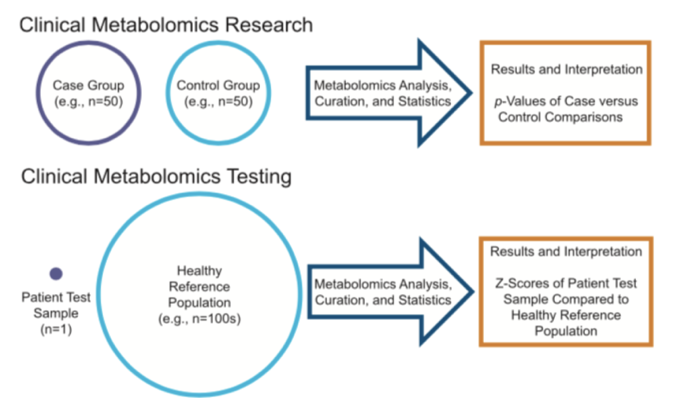

# Metabolomics-Data-Portal
Metabolomics Data Portal R shiny application for the visualization and analysis of untargeted metabolomics datasets.

Motivation:





Features:
1. Datasets included from published papers including clinical subjects with metabolic diseases.
2. Pathway visualization software and statistical interpretation metrics.
3. New topology-based pathway enrichment analysis methods.
4. Private data upload portal to use above tools on private datasets.

## Installation
- Dependencies:
- with [remotes](https://cran.r-project.org/web/packages/remotes/index.html)
```{r}
remotes::install_github("NCBI-Hackathons/Metabolomics-Data-Portal")
```

## Usage

## Data formats
- Input data
  - tabular data with rows as metabolites and columns as samples; data should be transformed Z-scores
- [Example data](https://github.com/NCBI-Hackathons/Metabolomics-Data-Portal/tree/master/data)


## Example Shiny Site
- Configure the docker-compose.yml file to point to your apps
- To spin up the shiny server, use the docker compose file from the command line:
```bash
docker-compose up -d
```
- To shut down the shiny server, use:
```bash
docker-compose down
```
- The dockerfile can also be built on your own:
```bash
docker build .
```

## References
